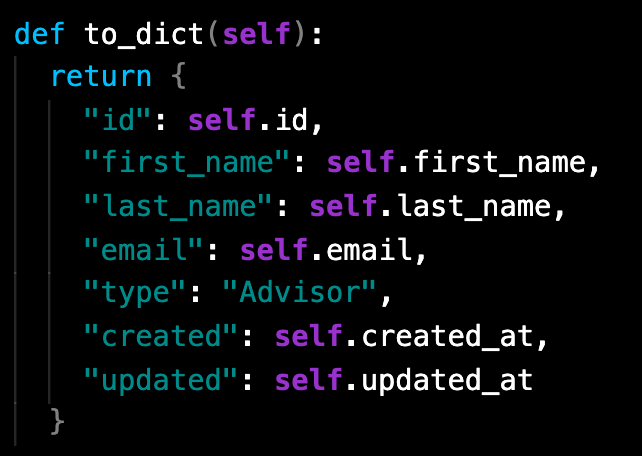
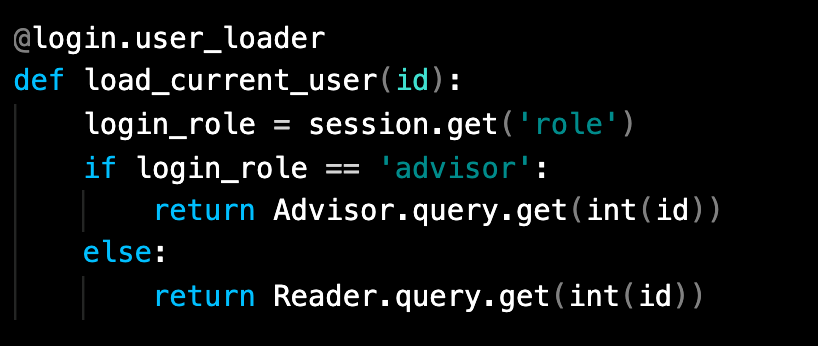
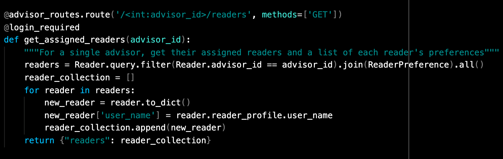

# Welcome to Readers' Advisory

## Greetings, fellow book enthusiasts!

### [Visit Readers' Advisory](https://readersadvisory.herokuapp.com/)

---

### Menu

[Technologies](#Technologies)

[Key Features](#Key-Features)

[Database Schema](https://github.com/jemcodes/readersAdvisory/wiki/Database-Schema)

[Front End Routes](https://github.com/jemcodes/readersAdvisory/wiki/Front-End-Routes)

[Backend API Routes](https://github.com/jemcodes/readersAdvisory/wiki/Backend-API-Routes)

[Project Details](#Project-Details)

[Feature Spotlight](#Feature-Spotlight)

[Challenges](#Challenges)

[Code Snippets](#Code-Snippets)

<!-- [Redux Store Tree Samples](https://github.com/jemcodes/ginAndTonnies/wiki/Redux-Store-Tree-Samples) -->

[Adobe XD Design Mockups](https://github.com/jemcodes/readersAdvisory/wiki/Adobe-XD-Design-Mockups)

[Application Design](#Application-Design)

[Installation Instructions](#Installation-Instructions)

[Visit Readers' Advisory!](https://readersadvisory.herokuapp.com/)

[Meet The Dev](#Meet-The-Dev)

[Future Features](#Future-Features)

[Future Fixes](#Future-Fixes)

---

### Technologies
* Python
* Flask 
* React
* Redux
* JavaScript
* JSX
* HTML
* CSS
* SQLAlchemy
* PostgreSQL
* Heroku
* VSCode
* Adobe Photoshop
* Adobe XD
* DrawSql
* npm

### Key Features

**Reader Account Management**
* View reader preferences generated through reader quiz
* Dynamically create, update, and delete reader's preferences
* View reader's subscription
* Dynamically create, update, and delete reader's subscription
* Dynamically delete reader's account - **currently only available for non-Demo user to preserve Demo experience**

**Secondary Login Auth Path**
* Advisors have dedicated login process
* View readers assigned to an advisor

### Project Details
>“We read books to find out who we are. What other people, real or imaginary, do and think and feel... is an essential guide to our understanding of what we ourselves are and may become.”
― Ursula K. LeGuin

My Readers' Advisory Full-Stack Project aims to unite readers with books they'll love. One-part subscription box service, one-part blind date with a book, topped with a little library science and served up fresh, just for you!

### Visit Readers' Advisory
https://readersadvisory.herokuapp.com/

### Feature Spotlight
* Readers can create, read, update, and delete book preferences. 
* Readers can also create, read, update, and delete subscriptions.
* When a reader is done with the service, they can delete their account and moved on - no strings attached. **(Currently only available for non-Demo user to preserve Demo experience)**
* Advisors can view a simple dashboard listing the readers assigned to them.

### Challenges
One of the biggest challenges I faced with this project was implementing two separate login paths for two different types of users. Because I want my Advisors to be able to put together orders specifically based on their Advisees' preferences, I needed to protect that information for the right eyes only.

Having only ever worked with authorizing and authenticating a single type of user, I had to do my research! I created separate role types and wrote dedicated routes for each to grant the appropriate permissions to the correct users.

### Code Snippets
*Examples from advisor authorization and authentication work:*

*Complex Query to get a list of Readers assigned to an Advisor and to include access to each Reader's preferences:*

### Application Design
*Navigation Bar Menus*

Demonstrates different menu experiences based on user needs

### [View Additional Screenshots](https://github.com/jemcodes/readersAdvisory/wiki/Application-GIFs-and-Screenshots)

### Installation Instructions
* Git clone the project file
* On your local machine, run `pipenv install` to install required dependencies.
* Initiate database setup as shown in .env.example and run database commands (migrate, seed, etc.)
* Enter your pip environment.
* In first terminal, use `flask run` to start backend.
* In second terminal, use `npm start` to start the front end server.
* Server should automatically navigate you to localhost:port in browser.

### [Visit Readers' Advisory](https://readersadvisory.herokuapp.com/)

### Meet The Dev

Hiya, I'm jane! 👋

Programming brings together my passions for building, creating, and problem-solving. Before coming to the coding world, I worked several lifetimes' worth of creative and analytical careers, from founding and managing companies to voiceover work to digging deep into disability law - and almost everything else in between. As a multipotentialite, I'm thrilled to see where this programming journey takes me!

You can find me right here on [Github](https://github.com/jemcodes) or over on [Linkedin](https://www.linkedin.com/in/jemcodes/) 

---

## Future Features

**Advisor CRUD**
* See a list of all orders assigned to an advisor
* Get a list of all products from which to curate orders
* Create, update, and delete orders

**Message CRUD**
* Readers and Advisors can see a list of all their messages
* Readers and Advisors can create, update, and delete messages

**Full Reader Dashboard**
* Expand simple preferences view to include more robust checkout and subscription management

**Full Advisor Dashboard**
* Expand simple reader view to include varieties of tasks and phases for Advisor's work progress with particular Readers

**Stripe Integration**
* Expand Reader checkout from simple credit to Stripe dev-mode checkout

## Future Fixes

**Additional Protections**
* Amplify security measures, particularly backend considerations
* Improve subscription/checkout process with success notifications

